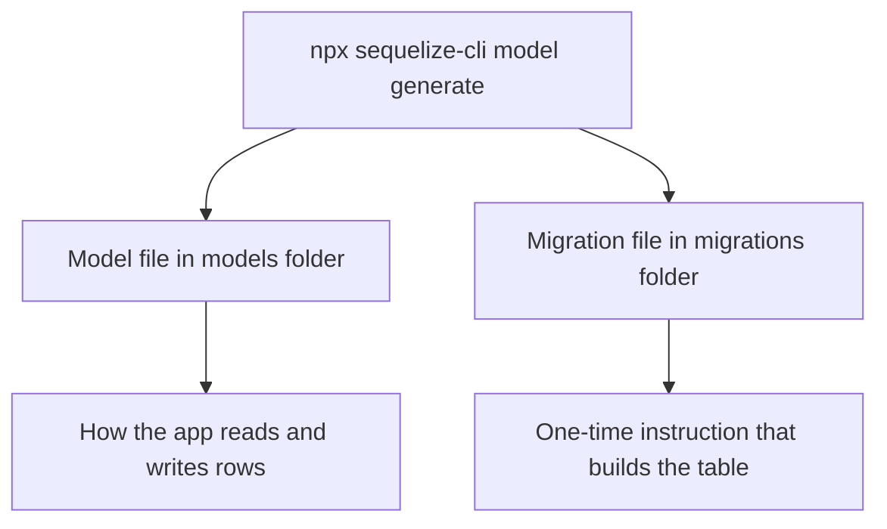
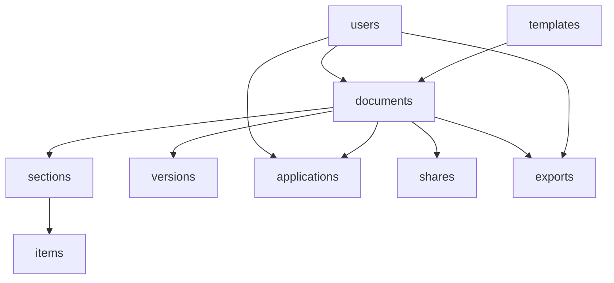

# Our Database with Sequelize —

## 1. What We Actually Did Today

We ran nine commands. Each one looks like this:

```bash
npx sequelize-cli model:generate --name User --attributes name:string,email:string
```

And each one created **two** files at once:

- a **model** in `models/`, the JavaScript object your code will talk to
- a **migration** in `migrations/`, the instructions that build the real table

> **Model vs migration, the difference that confuses everyone at first**
> The **migration** is a set of instructions: "make a table called users with these columns." You run it once and the table exists. The **model** is how your running app reads and writes rows in that table every day.
> Migration builds the shelf; model puts things on and off the shelf. One command wrote both, already matching each other.

---



## 2. The Nine Commands, in Order

Run them top to bottom. The order is not random — it follows what depends on what (more on that in section 5).

```bash
npx sequelize-cli model:generate --name User \
  --attributes name:string,email:string,password:string,tier:enum:'{free,pro}',aiCredits:integer

npx sequelize-cli model:generate --name Template \
  --attributes name:string,config:text

npx sequelize-cli model:generate --name Document \
  --attributes title:string,type:enum:'{resume,cover_letter}',userId:integer,templateId:integer

npx sequelize-cli model:generate --name Section \
  --attributes heading:string,position:integer,documentId:integer

npx sequelize-cli model:generate --name Item \
  --attributes content:text,position:integer,sectionId:integer

npx sequelize-cli model:generate --name Version \
  --attributes snapshot:text,label:string,documentId:integer

npx sequelize-cli model:generate --name Application \
  --attributes company:string,role:string,\
status:enum:'{saved,applied,interview,offer,rejected}',userId:integer,documentId:integer

npx sequelize-cli model:generate --name Share \
  --attributes slug:string,documentId:integer

npx sequelize-cli model:generate --name Export \
  --attributes format:enum:'{pdf,docx}',fileUrl:string,documentId:integer,userId:integer
```

### Reading the Command Itself

- `npx sequelize-cli model:generate` — the command that creates a model + migration pair
- `--name User` — the name of the table/model
- `--attributes` — the list of columns, `columnName:type`
- `name:string` — a text column
- `config:text` — a long-text column (like a resume summary)
- `aiCredits:integer` — a whole-number column
- `tier:enum:'{free,pro}'` — a column restricted to a fixed list of values

---

## 3. The Nine Tables, and What Each Holds

| Table | What it stores | Points to |
|-------|------------------|-----------|
| `users` | the account: name, email, password, tier, AI credits | nothing (top of the tree) |
| `templates` | a design a resume can use | nothing |
| `documents` | one resume or cover letter, the central table | users, templates |
| `sections` | a block in a document (Experience, Skills) | documents |
| `items` | one line inside a section (a single job) | sections |
| `versions` | a saved snapshot of a document | documents |
| `applications` | a tracked job application | users, documents |
| `shares` | a public link to a document | documents |
| `exports` | a generated PDF or DOCX record | documents, users |

---

How the Tables Connect — The Relationship Structure

The whole database can be thought of as one connected structure, where an arrow points from a table to the table it depends on. For example, a `section` belongs to a `document`, so `sections` points to `documents`.



`documents` sits at the center of the schema — almost every other table either points to it directly, or points to something that points to it. `users` sits at the top, since accounts don't depend on anything else in the system.

**Foreign key behavior inside migrations:** a migration for a column like `userId` includes a reference back to its parent table, along with what should happen on update or delete:

```javascript
userId: {
  type: Sequelize.INTEGER,
  references: { model: 'Users', key: 'id' },
  onUpdate: 'CASCADE',
  onDelete: 'CASCADE'
}
```

This is the same `CASCADE` behavior introduced on Day 1 — if a user is deleted, everything referencing that user through `CASCADE` is automatically deleted too, instead of being blocked or left orphaned.

The model files declare the same relationship in JavaScript, using an `associate()` function, for example:

```javascript
Document.belongsTo(models.User, { foreignKey: 'userId' });
Document.hasMany(models.Section, { foreignKey: 'documentId', onDelete: 'CASCADE' });
```

---

### 4. Running Migrations

```
npx sequelize-cli db:migrate            # build every table
npx sequelize-cli db:migrate:undo       # undo the last table
npx sequelize-cli db:migrate:undo:all   # undo everything
npx sequelize-cli db:migrate:status     # see what has run
```

Migrations must run in a specific order, not a random one, because tables depending on other tables (like `documents` depending on `users`) need their parent table to already exist first.

---


## 🎯 What We Did Today

- Ran **9 `model:generate` commands**, each producing a matching **model** (`models/`) and **migration** (`migrations/`) pair.
- Learned the difference: **migration builds the shelf, model puts things on and off the shelf.**
- Mapped out all **9 tables** — `users`, `templates`, `documents`, `sections`, `items`, `versions`, `applications`, `shares`, `exports` — and what each one points to.
- Saw how foreign keys are declared twice: once in the migration (the real database constraint) and once in each model's `associate()` function (how Sequelize understands the relationship in code).
- Learned the `db:migrate` commands used to actually build (and undo) the tables.

