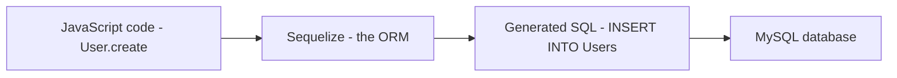

## ORM and Sequelize

### 1. What is an ORM?

**ORM (Object-Relational Mapper) — Definition:** a tool that lets code interact with a database using objects and functions in a programming language, instead of writing raw SQL by hand. Sequelize is the ORM used here, and it talks to MySQL underneath.

### 2. Why Use Sequelize When SQL Already Works?

Raw SQL works perfectly well — everything on Day 1 was done in plain SQL. So why add an ORM on top of it?

- **Write JavaScript, not SQL strings.** Instead of hand-writing `INSERT INTO ... VALUES (...)`, a model method like `User.create({...})` is called, and Sequelize generates the correct SQL automatically.
- **Safety by default.** Sequelize automatically escapes values passed into queries, which protects against SQL injection without extra manual effort.
- **One definition, reused everywhere.** A model (like `User`) describes the table's shape once. Every part of the application that needs to read or write users reuses that same definition, instead of retyping column names and types in every query.
- **Relationships become simple method calls.** Instead of writing a `JOIN` by hand every time, a relationship like "a user has many resumes" is declared once, and Sequelize handles generating the joins whenever data linked to it is requested.
- **Cross-database portability.** The same Sequelize code can, with a small config change, talk to PostgreSQL or SQLite instead of MySQL, because Sequelize is the layer translating JavaScript into whatever SQL dialect the underlying database needs.

> **Analogy — A Translator at a Meeting**
> Writing raw SQL is like speaking directly in the database's own language, every single time you need something. Sequelize is like hiring a translator who sits in the meeting — you speak plain JavaScript, and the translator converts it into correct, properly-formatted SQL. The output is the same, but it's less error-prone and easier to work with.


---
---


### ORM Architecture

```
┌──────────────────────────────────────────────────────┐
│         Your JavaScript Application                  │
│  (Objects, functions, business logic)                │
└──────────────────────────┬───────────────────────────┘
                           │
                    Uses objects/models
                           │
┌──────────────────────────▼───────────────────────────┐
│            ORM (Sequelize)                           │
│  Translates JS objects → SQL queries                 │
│  Translates SQL results → JS objects                 │
└──────────────────────────┬───────────────────────────┘
                           │
                  Executes SQL queries
                           │
┌──────────────────────────▼───────────────────────────┐
│         Database (MySQL, PostgreSQL, etc.)           │
│  Stores data in tables                               │
└──────────────────────────────────────────────────────┘
```

---

### What is Sequelize?

**Sequelize** is a **popular ORM for Node.js** that makes working with SQL databases easier.

**Key Features:**
- Works with multiple databases (MySQL, PostgreSQL, SQLite, MSSQL)
- Write database models in JavaScript
- Automatic SQL query generation
- Data validation and constraints
- Associations (relationships between models)
- Migrations (version control for database structure)

---

### Sequelize in Action

#### Without ORM (Raw SQL)

```javascript
// You have to write SQL strings manually
const result = await connection.query(
  "SELECT * FROM users WHERE id = ? AND email = ?",
  [userId, userEmail]
);

// Converting results to JavaScript objects manually
const user = {
  id: result[0].id,
  name: result[0].name,
  email: result[0].email,
  created_at: result[0].created_at
};
```

**Problems:**
- 🔴 Writing SQL strings by hand (error-prone)
- 🔴 Manual result conversion
- 🔴 Hard to validate SQL at development time
- 🔴 Repetitive code
- 🔴 SQL injection risks if not careful

---

#### With Sequelize ORM

```javascript
// Define your model (JavaScript object)
const User = sequelize.define('User', {
  id: {
    type: DataTypes.INTEGER,
    primaryKey: true,
    autoIncrement: true,
  },
  name: DataTypes.STRING,
  email: DataTypes.STRING,
  createdAt: DataTypes.DATE,
});

// Query using JavaScript methods (not SQL strings!)
const user = await User.findByPk(userId);
// Sequelize automatically generates: SELECT * FROM users WHERE id = ?

// Or with conditions
const user = await User.findOne({
  where: { id: userId, email: userEmail }
});
// Sequelize generates: SELECT * FROM users WHERE id = ? AND email = ?

// Result is automatically a JavaScript object
console.log(user.name);     // Direct property access
console.log(user.email);    // Type-safe
```

**Advantages:**
- ✅ Write JavaScript, not SQL strings
- ✅ Automatic type safety
- ✅ Query validation at development time
- ✅ Less repetitive code
- ✅ Built-in security against SQL injection
- ✅ Results are JavaScript objects automatically

---

### Sequelize Key Concepts

#### 1. Models

A **model** is a JavaScript representation of a database table.

```javascript
const User = sequelize.define('User', {
  // Column definitions
  id: {
    type: DataTypes.INTEGER,
    primaryKey: true,
    autoIncrement: true,
  },
  email: {
    type: DataTypes.STRING,
    allowNull: false,
    unique: true,
  },
  name: DataTypes.STRING,
  isActive: {
    type: DataTypes.BOOLEAN,
    defaultValue: true,
  },
  role: DataTypes.ENUM('admin', 'user', 'guest'),
});

// Now you can use User to query the database
```

---

#### 2. Associations (Relationships)

Define relationships between models.

```javascript
// One-to-Many: One user has many posts
User.hasMany(Post);
Post.belongsTo(User);

// Many-to-Many: Users and projects
User.belongsToMany(Project, { through: 'UserProject' });
Project.belongsToMany(User, { through: 'UserProject' });

// Usage in queries
const userWithPosts = await User.findOne({
  where: { id: userId },
  include: [Post]  // Automatically joins the posts table
});
```

**Sequelize generates the complex SQL JOIN automatically!**

---

#### 3. Queries

```javascript
// CREATE
const newUser = await User.create({
  email: 'john@example.com',
  name: 'John Doe',
  role: 'user'
});

// READ - Single record
const user = await User.findByPk(1);

// READ - Multiple records
const allUsers = await User.findAll({
  where: { isActive: true }
});

// UPDATE
await user.update({ name: 'Jane Doe' });

// DELETE
await user.destroy();
```

**All of this is translated to SQL by Sequelize!**

---
