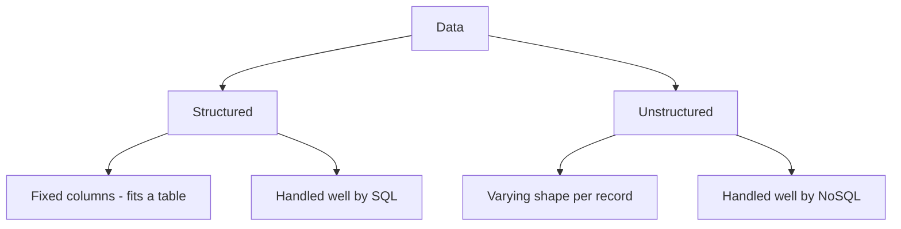
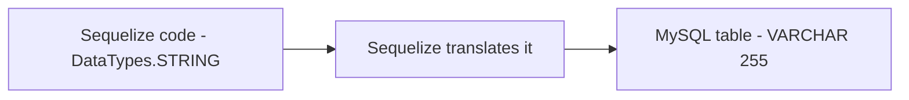

# SQL, NoSQL & How Data Is Stored 

## 1. What Is a Database, and What Is a DBMS

A **database** is an organised collection of data. That is all the word means: data, kept in order so you can find it. But the data does not manage itself. Something has to store it, protect it, and answer questions about it. That something is the **DBMS**.

> **DBMS — Database Management System**
> The software that stores and manages a database for you. It handles saving data, reading it back, keeping it safe, and letting many people use it at once. MySQL is a DBMS. So are PostgreSQL, Oracle, and MongoDB. When you "install MySQL," you are installing a DBMS.

So the **database** is the data. The **DBMS** is the program that looks after it. People often say "database" for both, but now you know the difference.

## 2. What Is a Language, and What Is a Query

You talk to a DBMS in a **language**. Just as you write JavaScript to talk to a browser, you write database commands in a database language. The most common one is SQL.

> **Query**
> A single question or command you send to the database. "Give me all users from Haldwani" is a query. "Add this new user" is a query. Every time your app reads or writes data, it sends a query. The word comes from "to ask": a query asks the database to do something.

So a **language** is how you speak to the database, and a **query** is one thing you say in that language.

## 3. SQL vs NoSQL

**SQL databases — Definition:** relational databases that store data in structured tables with a predefined schema, enforced before any data goes in.

**NoSQL databases — Definition:** databases that store data in flexible, unstructured or semi-structured formats, without requiring a fixed schema in advance.

| Aspect | SQL | NoSQL |
|---|---|---|
| Data model | Tables (rows and columns) | Documents, key-value pairs, graphs |
| Schema | Fixed, defined up front | Flexible, can change per record |
| Relationships | Foreign keys, joins | Loose references |
| Scaling | Vertical — add power to one server | Horizontal — add more servers |
| Examples | MySQL, PostgreSQL, Oracle | MongoDB, Redis, Cassandra |

### 4 Structured vs Unstructured Data

**Structured data — Definition:** data that fits neatly into rows and columns, where every record follows the exact same shape (this is what SQL is built for).

**Unstructured data — Definition:** data that doesn't follow a fixed shape — different records can have different fields, or the data may not be tabular at all (text, images, logs). This is what NoSQL is built for.

> **Analogy — A Printed Form vs a Diary Entry**
> Structured data is like a printed government form — every copy has the same fields, in the same order, and a blank field is obviously missing. Unstructured data is like a diary entry — one day might be three lines, another day three pages with a sketch in the margin. Both are valid data, but only one fits neatly into a table.

## Structured vs Unstructured Data

### Structured Data

**Definition:** Data organized in a **predefined format** with a clear structure.

**Characteristics:**
- Organized in tables, rows, and columns
- Follows a fixed schema
- Every record has the same fields
- Easily queryable and searchable
- Predictable format

**Examples:**
- Employee database (consistent columns: name, email, salary, department)
- Customer orders (order ID, customer ID, amount, date)
- Product catalog (product name, price, description, stock)
- Bank transactions (account ID, amount, date, type)

**Storage:**
```sql
-- Example: Employee table (Structured)
CREATE TABLE employees (
  id INT PRIMARY KEY,
  name VARCHAR(100),
  email VARCHAR(100),
  salary DECIMAL(10, 2),
  department VARCHAR(50),
  hireDate DATE
);

-- Every record has exactly these 6 fields
-- All data follows the same structure
```

**Advantages:**
- ✅ Efficient querying and indexing
- ✅ Data consistency guaranteed
- ✅ Easier to validate and constrain
- ✅ Optimal for relationships (joins)
- ✅ Better for reporting and analytics

**Best Used With:** SQL Databases (MySQL, PostgreSQL, Oracle)

---

### Unstructured Data

**Definition:** Data that **doesn't follow a predefined structure** or schema.

**Characteristics:**
- No fixed format or organization
- Flexible schema (or no schema)
- Different records can have different fields
- Text, images, videos, audio
- Harder to search and query
- High volume, variety

**Examples:**
- Social media posts (different users, different content types)
- Log files (varying formats and fields)
- User-generated content (reviews, comments, articles)
- Images and videos
- Email messages
- Customer feedback and surveys

**Storage:**
```javascript
// Example: Social media posts (Unstructured)
// Post 1
{
  userId: 123,
  content: "Just had coffee!",
  timestamp: "2024-01-15T10:30:00Z",
  likes: 45
}

// Post 2 (different structure)
{
  userId: 456,
  content: "Check out this photo",
  image: "https://...",
  timestamp: "2024-01-15T11:00:00Z",
  likes: 200,
  comments: [{ userId: 789, text: "Nice!" }],
  hashtags: ["photography", "nature"]
}

// Post 3 (yet another structure)
{
  userId: 789,
  videoUrl: "https://...",
  duration: 120,
  caption: "Video tutorial",
  views: 1000,
  shares: 50
}

// Each post can have different fields!
```

**Advantages:**
- ✅ Flexible and adaptable to changing requirements
- ✅ Can handle diverse data types
- ✅ Scalable for massive data volumes
- ✅ Fast writes (no schema validation overhead)
- ✅ Good for rapid development (iterate quickly)

**Disadvantages:**
- ❌ Harder to query and search
- ❌ No guaranteed data consistency
- ❌ More complex to analyze
- ❌ Storage overhead (stores field names with every record)

**Best Used With:** NoSQL Databases (MongoDB, DynamoDB, Cassandra)

---

### Structured vs Unstructured: Comparison

| Aspect | Structured | Unstructured |
|--------|-----------|--------------|
| **Format** | Fixed, predefined | Flexible, varying |
| **Schema** | Strict schema required | No fixed schema |
---

---



---

### 5. CHAR vs VARCHAR vs STRING

**CHAR(size) — Definition:** a fixed-length text column. It always reserves the exact number of character cells specified, no matter how much data is actually stored.

Example — storing "Deepesh" (7 letters) in `CHAR(10)`:
```
D | e | e | p | e | s | h | · | · | ·
= 10 cells always reserved (3 blank spaces added as padding)
```

**VARCHAR(size) — Definition:** a variable-length text column. It stores only the data actually provided, up to the given size limit.

Example — storing "Deepesh" (7 letters) in `VARCHAR(10)`:
```
D | e | e | p | e | s | h
= 7 cells used, no padding
```

**Rule of thumb:**
- Use **CHAR** when every value is exactly the same length — e.g. country codes (always 2 letters), fixed SKU codes.
- Use **VARCHAR** when text length varies — e.g. names, emails, addresses.

**STRING** is not a MySQL type at all — it's the name Sequelize (covered on Day 3) uses in JavaScript code. When a model defines `DataTypes.STRING`, Sequelize converts it into `VARCHAR(255)` in the actual MySQL table. STRING is the JavaScript-side label; VARCHAR is what really gets created in the database.



---

### 6. Other Data Types — ENUM, TINYINT, BOOLEAN

*
### Specialized MySQL Data Types

#### ENUM

**Definition:** A column that can hold **only one value from a predefined list**.

**Syntax:**
```sql
ENUM('value1', 'value2', 'value3')
```

**Example:**
```sql
CREATE TABLE posts (
  id INT PRIMARY KEY,
  title VARCHAR(255),
  status ENUM('active', 'pending', 'deleted')
);
```

**Use Cases:**
- ✅ Status fields (active, inactive, pending, archived)
- ✅ Category fields with fixed options
- ✅ Role fields (admin, user, guest)

**Advantages:**
- Prevents invalid data entry
- Keeps data consistent
- MySQL will reject any value not in the list
- Space-efficient (stored as integer internally)

**Example in Sequelize:**
```javascript
const Post = sequelize.define('Post', {
  title: DataTypes.STRING,
  status: DataTypes.ENUM('active', 'pending', 'deleted'),
});
```

---

#### BOOLEAN

**Definition:** A true/false column for yes-or-no questions.

**Typical Usage Examples:**
- `isVerified` — Is the user email verified?
- `termsAccepted` — Did the user accept terms?
- `isActive` — Is the account active?
- `isPremium` — Is the user a premium subscriber?

**In Sequelize:**
```javascript
const User = sequelize.define('User', {
  email: DataTypes.STRING,
  isVerified: DataTypes.BOOLEAN,      // false by default
  termsAccepted: DataTypes.BOOLEAN,   // false by default
  isActive: DataTypes.BOOLEAN,         // true by default
});
```

**Storage:**
- MySQL stores BOOLEAN as TINYINT(1)
- `true` = 1
- `false` = 0

---

#### TINYINT

**Definition:** A very small integer column (takes up minimal space).

**Range:**
- Signed: -128 to 127
- Unsigned: 0 to 255

**Use Cases:**
- User ratings (1-5 stars)
- Small counts
- Flags (0 or 1)
- Small age ranges

**Example:**
```sql
CREATE TABLE ratings (
  id INT PRIMARY KEY,
  stars TINYINT,  -- Stores 1-5
  helpful TINYINT  -- Stores 0 or 1 (like BOOLEAN)
);
```

**Storage Benefit:**
- TINYINT uses only 1 byte
- INT uses 4 bytes
- Important when storing millions of records

---
## 🎯 Recap

- A **database** is the data; a **DBMS** is the software that manages it (MySQL, PostgreSQL, Oracle, MongoDB).
- A **language** (like SQL) is how you talk to a DBMS; a **query** is a single command in that language.
- **VARCHAR** stores only what you use; **CHAR** always reserves the full fixed size, padding the rest.
- Sequelize's `DataTypes.STRING` becomes MySQL's `VARCHAR(255)` under the hood.
- **ENUM** restricts a column to a fixed set of values; **BOOLEAN** is a true/false column.

---
