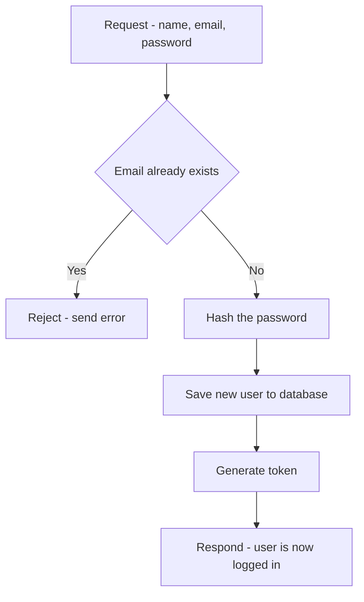
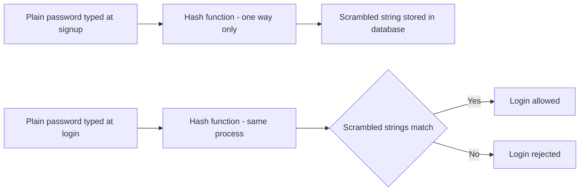
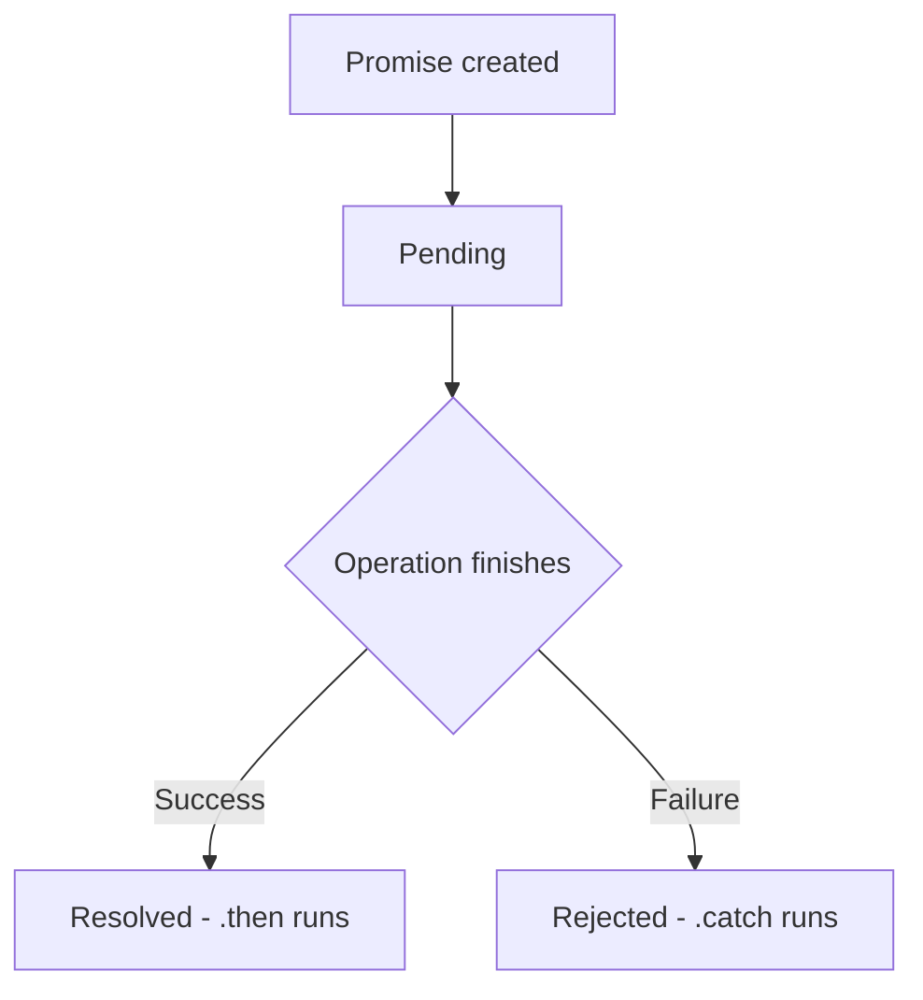
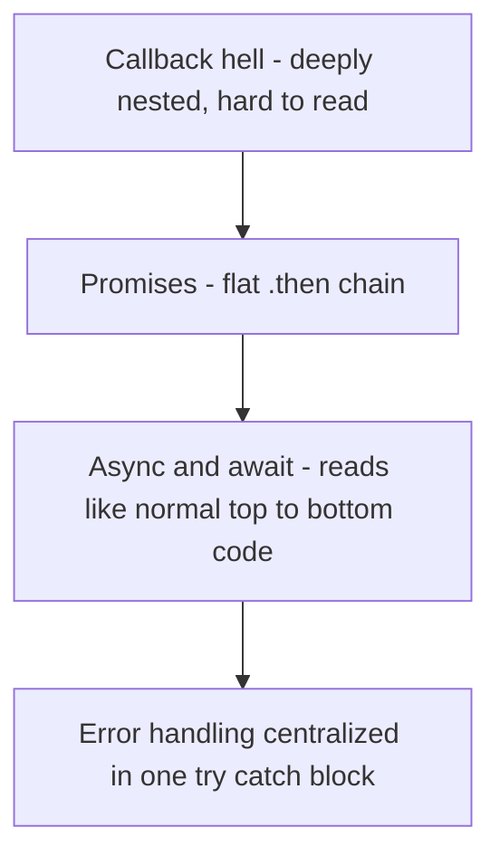

## Register API, Password Security, and Async JavaScript

###  The Register API

The register endpoint takes a name, email, and password from the request. It checks that the email is not already in use, saves the new user to the database, and returns a token, so the user is immediately logged in right after signing up — without needing a separate login step.

---

###  Password Encryption

A password is never stored exactly as it was typed. It is hashed first, so what sits in the database is a scrambled string, not the real password.

**Why one-way encryption specifically:** hashing is deliberately one-way. A password can be turned into its scrambled form, but the scrambled form can never be turned back into the original password. Even someone looking directly at the database cannot read anyone's real password.

At login, the newly typed attempt is hashed the same way, and the two scrambled strings are compared — not the two plain passwords. This means that even if a database is ever leaked, it still does not hand over anyone's real password.

> **Analogy — A One-Way Paper Shredder**
> Hashing a password is like feeding a piece of paper into a shredder that always produces the exact same confetti pattern for the exact same original page. Given the confetti, there's no way to reconstruct the original page. But if a new page is shredded and its confetti pattern matches an old one exactly, it proves it was the same original page — without ever needing to see the page itself again.

---

### Promises

**Promise — Definition:** a way to handle an operation that takes time, such as a database call or a request over the internet, without freezing the rest of the code while waiting. Instead of waiting, the code receives a Promise immediately, and the real result arrives later.

A Promise has three states:
- **Pending** — still waiting for the result
- **Resolved** — the operation succeeded
- **Rejected** — the operation failed

`.then` runs when a Promise resolves successfully. `.catch` runs when a Promise is rejected.

---

###  Callback Hell

**Callback hell — Definition:** what happens when one slow task depends on the result of another, which depends on another, and each step is handled using nested callback functions. The code keeps nesting deeper and drifting to the right of the screen with every added step, becoming hard to read and even harder to handle errors in.

> **Analogy — A Chain of Nested Boxes**
> Callback hell is like opening a gift box, only to find another wrapped box inside, then another inside that one, and so on. Each layer has to be fully opened before the next one is even visible, and if something goes wrong in the middle, it's unclear which box actually caused the problem.

---

###  Solving Callback Hell — Promises and Async/Await

**Promises flatten the nesting.** Instead of callbacks nested inside callbacks, a chain of `.then()` calls can be lined up one after another, at the same indentation level.

**Async/await goes a step further.** It lets the slow steps be written as if they run line by line, top to bottom — which reads like ordinary, sequential code, while error handling stays in one single place (a `try/catch` block), rather than being scattered across every nested callback.

