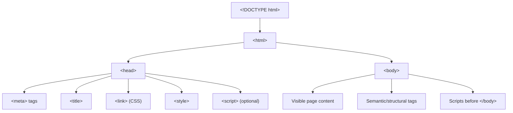
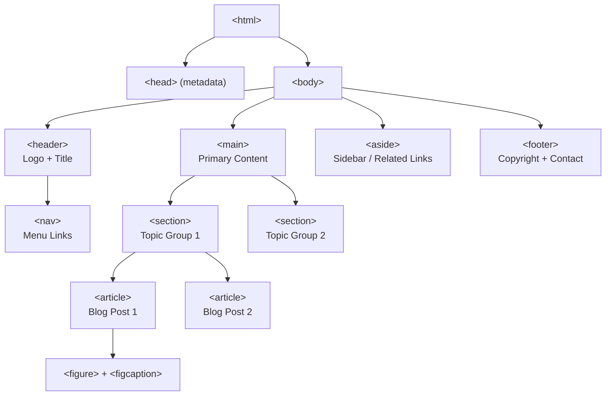

# Webdev-learning
## HTML

HTML (HyperText Markup Language) is the standard markup language used to create the structure and content of web pages. It uses **elements** represented by **tags** (e.g., `<p>`, `<div>`, `<header>`) to define different parts of a webpage — text, images, links, forms, and layout sections.

An HTML element usually consists of:
```html
<tagname attribute="value">Content goes here</tagname>
```


## Basic HTML Document Structure

```html
<!DOCTYPE html>
<html lang="en">
<head>
    <meta charset="UTF-8">
    <meta name="viewport" content="width=device-width, initial-scale=1.0">
    <title>Document Title</title>
</head>
<body>
    <!-- Visible content goes here -->
</body>
</html>
```

### Structure Flow



- `<!DOCTYPE html>` — tells the browser this is an HTML5 document.
- `<html>` — the root element wrapping the whole page.
- `<head>` — metadata: title, character set, linked CSS/JS, SEO tags. Not visible on the page.
- `<body>` — everything the user actually sees and interacts with.

---

## Categories of HTML Tags

HTML tags can be grouped into functional categories:

| Category | Purpose | Example Tags |
|---|---|---|
| **Document Metadata** | Info about the page | `<head>`, `<title>`, `<meta>`, `<link>`, `<style>` |
| **Sectioning / Semantic** | Structure & meaning | `<header>`, `<nav>`, `<main>`, `<section>`, `<article>`, `<aside>`, `<footer>` |
| **Text Content** | Paragraphs, headings, lists | `<h1>`–`<h6>`, `<p>`, `<ul>`, `<ol>`, `<li>`, `<blockquote>` |
| **Inline Text Semantics** | Meaning within text | `<a>`, `<strong>`, `<em>`, `<span>`, `<mark>`, `<small>`, `<time>` |
| **Embedded Content / Media** | Images, video, audio | ``, `<video>`, `<audio>`, `<iframe>`, `<source>` |
| **Table Content** | Tabular data | `<table>`, `<tr>`, `<td>`, `<th>`, `<thead>`, `<tbody>` |
| **Forms** | User input | `<form>`, `<input>`, `<button>`, `<select>`, `<textarea>`, `<label>` |
| **Interactive Elements** | UI interactivity | `<details>`, `<summary>`, `<dialog>` |
| **Scripting** | Dynamic behavior | `<script>`, `<noscript>`, `<canvas>` |
| **Generic Containers** | Non-semantic grouping | `<div>`, `<span>` |

---

## Semantic HTML Tags — In Detail

Semantic tags **clearly describe their meaning** to both the browser and the developer, unlike generic tags like `<div>` or `<span>` which carry no inherent meaning. Semantic HTML improves **accessibility**, **SEO**, and **code readability**.

### 1. `<header>`
Represents introductory content — usually contains a logo, site title, or navigation. A page can have multiple `<header>` elements (e.g., one for the page, one inside an `<article>`).

```html
<header>
    <h1>My Website</h1>
    <nav>...</nav>
</header>
```

**Use case:** Top banner of a site or the intro block of an article/section.

---
### 2. `<main>`
Represents the **dominant, unique content** of the document. There should only be **one** `<main>` per page, and it should not be nested inside `<header>`, `<footer>`, `<nav>`, or `<aside>`.

```html
<main>
    <h2>Blog Posts</h2>
    <article>...</article>
</main>
```

---

### 3. `<section>`
A **thematic grouping** of content, typically with its own heading. Used to divide a page into logical parts (e.g., "Features", "Testimonials", "Pricing").

```html
<section>
    <h2>Our Services</h2>
    <p>...</p>
</section>
```
---

### 4. `<article>`
Represents **self-contained, independently distributable** content — something that would still make sense if pulled out of context (a blog post, news story, forum post, product card).

```html
<article>
    <h2>Post Title</h2>
    <p>Content...</p>
</article>
```

**Section vs Article:** An `<article>` can contain `<section>` elements, and a `<section>` can contain `<article>` elements — the distinction is about **independence** (article) vs **thematic grouping** (section).

---

### 5. `<aside>`
Content **tangentially related** to the surrounding content — sidebars, pull quotes, ads, related links.

```html
<aside>
    <h3>Related Articles</h3>
    <ul>...</ul>
</aside>
```

---
### 6. `<figure>` 
Groups **self-contained media** (image, diagram, code snippet) with an optional caption.

```html
<figure>
    
</figure>
```

---

### 7. `<time>`
Represents a specific date/time in a machine-readable format via the `datetime` attribute.

```html
<time datetime="2026-07-10">July 10, 2026</time>
```

---


## Semantic Layout Flowchart

This diagram shows how semantic tags typically nest together to form a full webpage layout:




---

## Quick Reference Table

| Tag | Semantic? | Purpose |
|---|:---:|---|
| `<header>` | ✅ | Intro/banner content |
| `<nav>` | ✅ | Navigation links |
| `<main>` | ✅ | Main unique content (one per page) |
| `<section>` | ✅ | Thematic content grouping |
| `<article>` | ✅ | Self-contained, reusable content |
| `<aside>` | ✅ | Related/tangential content |
| `<footer>` | ✅ | Closing/contact/copyright info |
| `<figure>` / `<figcaption>` | ✅ | Media with caption |
| `<time>` | ✅ | Machine-readable date/time |
| `<mark>` | ✅ | Highlighted text |
| `<details>` / `<summary>` | ✅ | Collapsible content widget |
| `<div>` | ❌ | Generic block container |
| `<span>` | ❌ | Generic inline container |
| `<b>` | ❌ | Bold text (visual only) |
| `<i>` | ❌ | Italic text (visual only) |

## Summary

- HTML tags define the **structure and meaning** of web content.
- **Semantic tags** (`<header>`, `<nav>`, `<main>`, `<section>`, `<article>`, `<aside>`, `<footer>`, etc.) tell browsers, developers, and assistive technologies (like screen readers) *what* the content means — not just how it looks.
- Using semantic HTML properly improves **SEO ranking**, **accessibility**, and **maintainability** of your code.
- Reserve `<div>` and `<span>` for cases where no semantic tag fits and you just need a styling/grouping hook.
