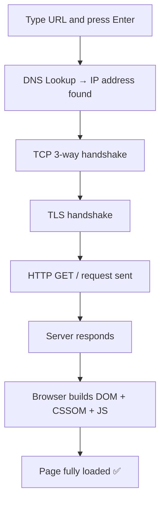

# What Happens When You Hit Enter 

You type a website address and press Enter. It feels instant — but a lot happens in that half-second. 

## The 5 Stages

### 1. DNS – Find the Address
- Computers only understand **numbers (IPs)**, not names like `google.com`
- DNS is basically the internet's **phonebook**
Real CMD Output (nslookup shorterloop.com)
Server:   reliance.reliance
Address:  2405:201:680d:d2be::c0a8:1d01

Non-authoritative answer:
Name:     shorterloop.com
Address:  199.36.158.100
"Non-authoritative answer" means this answer came from a DNS cache, not directly from the website's own DNS server.

Real CMD Output (nslookup shorterloop.com)
```
Server:   reliance.reliance
Address:  2405:201:680d:d2be::c0a8:1d01

Non-authoritative answer:
Name:     shorterloop.com
Address:  199.36.158.100
```
"Non-authoritative answer" means this answer came from a DNS cache, not directly from the website's own DNS server.

### 2. TCP – Open a Connection
Before sending any data, the browser and server shake hands to open a reliable connection (the "three-way handshake"):
```
Browser                          Server
  │                                │
  ├──────────── SYN ──────────────►│
  │     "Hey, can we talk?"        │
  │                                │
  │◄────────── SYN-ACK ────────────┤
  │     "Sure, I am ready!"        │
  │                                │
  ├──────────── ACK ──────────────►│
  │     "Perfect, let us begin"    │
  │                                │
  ▼                                ▼
       [Connection Established]
```
       

   ### 3. TLS – Make It Secure
This is the "S" in **HTTPS**. It encrypts the connection so no one can spy on your data, and it verifies the server is really who it says it is (via a certificate).

   ### 4. HTTP 
The browser sends a **request** , the server sends back a **response**.
- **Methods:** GET (read), POST (create), PUT (update), DELETE (remove)
- **Common status codes:** 200 OK, 301 Moved, 404 Not Found, 500 Server Error
- 
- 
    ## HTTP Request
  
With a secure connection established, the browser sends a request
```
GET / HTTP/1.1
Host: shorterloop.com
Accept: text/html,application/xhtml+xml
Accept-Language: en-US,en;q=0.9
Accept-Encoding: gzip, deflate, br
Connection: keep-alive
Cache-Control: max-age=0
User-Agent: Mozilla/5.0 (Windows NT 10.0; Win64)
```

GET / → Request the homepage
Host → Which website (one server can host many sites)
Cache-Control → Do we need fresh content or is cache okay?
User-Agent → Browser identifies itself to the server


## HTTP Response 

The server processes the request and sends back a response.


| Code | Status | Meaning |
|---|---|---|
| 200 | OK | Resource found and delivered |
| 301 | Moved Permanently | URL changed, redirecting |
| 304 | Not Modified | Use your cached version |
| 404 | Not Found | Page does not exist |
| 500 | Internal Error | Something broke on server side |

Real Response Example

```
HTTP/1.1 304 Not Modified
```

304 means: The browser already had a cached copy. The server confirmed nothing has changed — use the cached file. This saves bandwidth and makes the page load faster.


   
### 5. Render – Draw the Page
where a web browser converts raw code (HTML, CSS, and JavaScript) into a visual webpage that you can see and interact with on your screen

Parsing: The browser reads your HTML and CSS code to understand the structure and style.

Combining: It merges the structure and style together to plan the layout.

Arranging: It calculates exactly where every text, image, and box should go on the screen.

Painting: It draws the pixels, colors, and images onto your screen.


## Client vs Server

| Client (Browser) | Server |
|---|---|
| Runs on your device | Always on, waiting for requests |
| Sends requests | Runs backend code |
| Renders HTML/CSS/JS | Talks to the database |
| Can't be trusted with secrets | Holds the real data & secrets |

## Cache Types Explained


```
Memory Cache  → Stored in RAM, ultra fast (0ms)
Disk Cache    → Stored on hard drive, fast (4ms)
No Cache      → Fresh download from server, slower
```

---

## Why This Matters
This is the foundation for everything you'll build:
- **Frontend:** HTML, CSS, JavaScript, Angular
- **Backend:** Node.js, Express, REST APIs
- **Database:** MySQL, MongoDB
- **Connections:** HTTP, status codes, authentication

- ## SUMMARY

```mermaid
graph TD
    A[Type URL and press Enter] --> B[DNS Lookup → IP address found]
    B --> C[TCP 3-way handshake]
    C --> D[TLS handshake]
    D --> E[HTTP GET / request sent]
    E --> F[Server responds]
    F --> G[Browser builds DOM + CSSOM + JS]
    G --> H[Page fully loaded ✅]
```

*"Instant" was never instant. Once you understand the machinery, you can debug it, speed it up, and build it.*

Notes by DIVYANI — BCA 2nd year, Amrapali University,
Real data captured using Chrome DevTools (Network Tab) and Windows CMD (nslookup)
